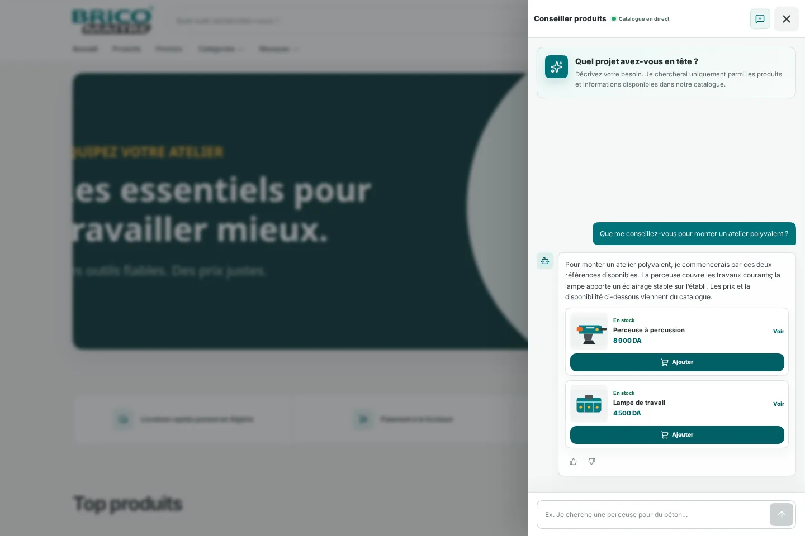
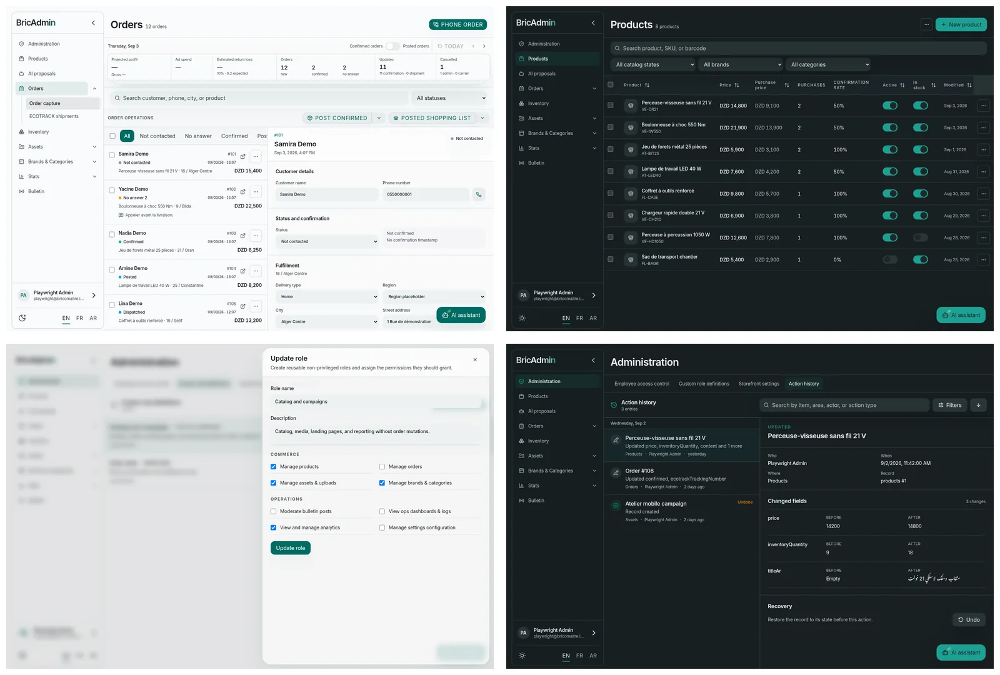
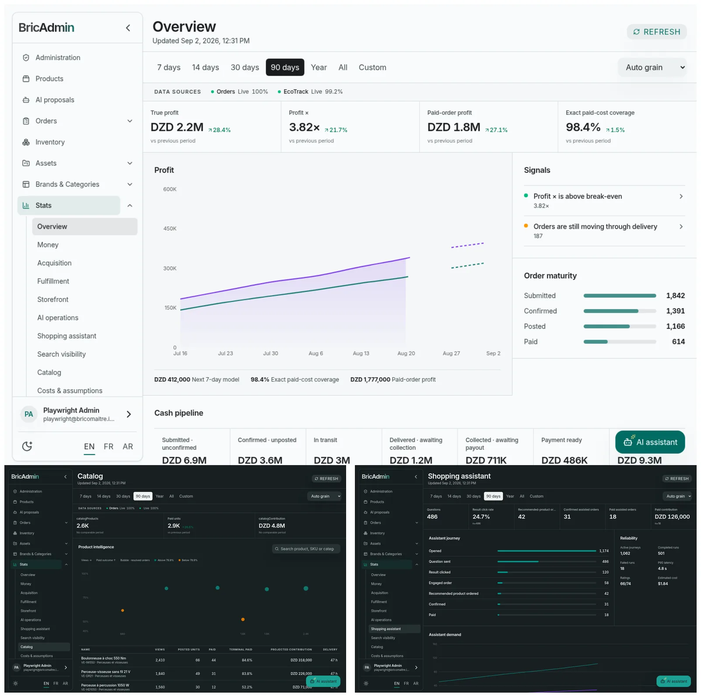
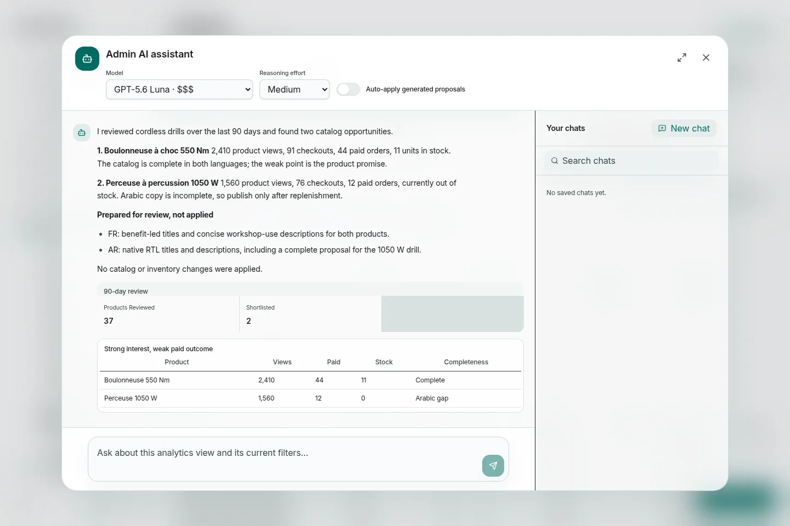
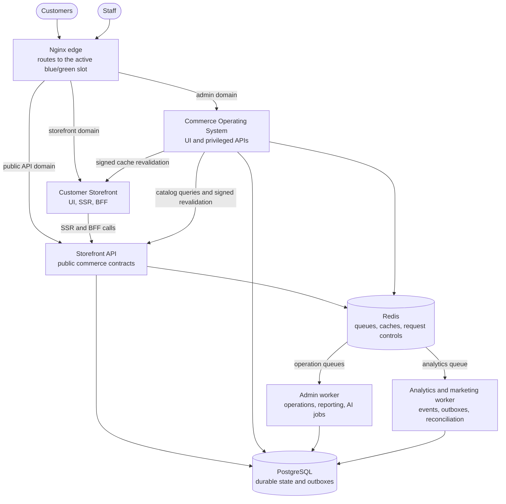
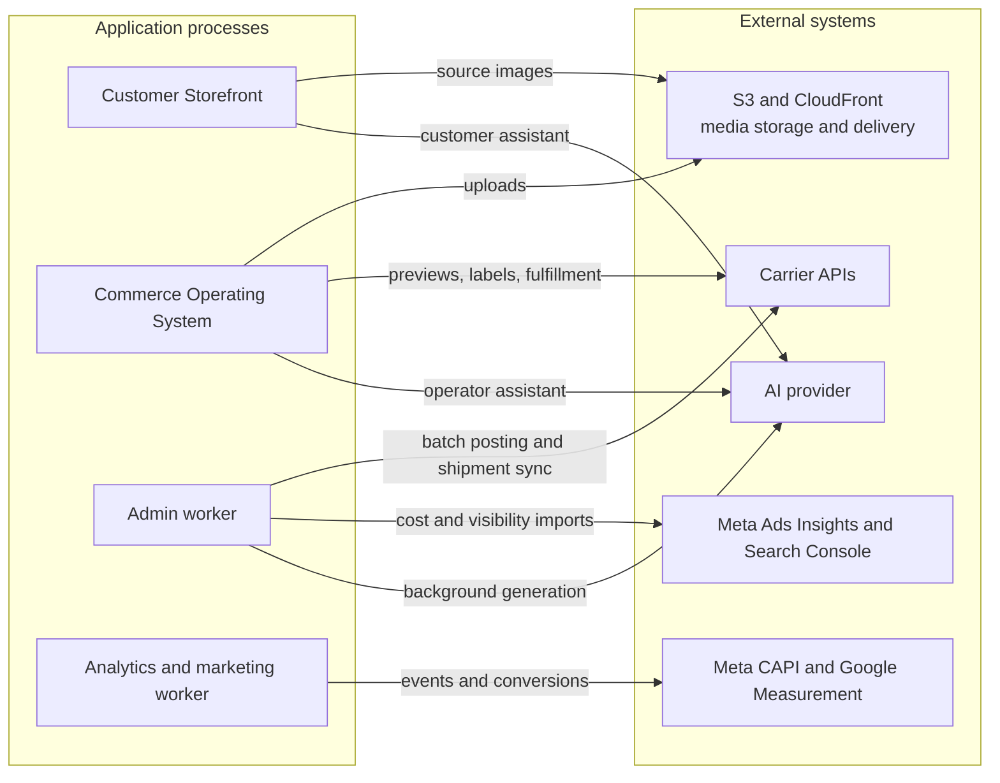

# Bricomaitre

Production commerce software built for phone-confirmed cash on delivery in Algeria.

Bricomaitre combines a customer storefront with the Commerce Operating System
used to confirm, fulfill, and understand orders. They are equal halves of one
product, built and maintained by [Mild](https://github.com/MilD-0). The system
also includes two grounded assistants: one helps customers navigate the live
catalog, while the other helps staff investigate and prepare operational work.

[Live storefront](https://bricomaitre.com) · [Demo](https://bricomaitre.mildsauce.cloud) ·
[Demo admin](https://bricomaitre-admin.mildsauce.cloud) · [Source](https://github.com/MilD-0/Bricomaitre) ·
[Email Mild](mailto:mayldsauce@gmail.com)

The hosted demo runs on my own machine over an unreliable connection, so it may
be slow or offline. You can [run it locally](./docs/demo.md#run-it-locally), or
[email me](mailto:mayldsauce@gmail.com) if you need it running at a particular time.

## Production figures

|            16.4k |                         US$160k |            2.6k |                99.998% |
| ---------------: | ------------------------------: | --------------: | ---------------------: |
| submitted orders | paid COD in the last six months | catalog records | monitored availability |

These figures were observed on September 2, 2026, not estimated from a demo.
The paid amount is a rounded conversion of DZD 20.95 million recorded by the
fulfillment carrier. UptimeRobot recorded one incident and 5 minutes 6 seconds
of downtime from January 1 through August 22, 2026. The system runs on an 8 GB
VPS that costs €17 per month. S3 and CloudFront serve uploaded media for less
than US$0.50 per month.

## Why it exists

Generic commerce platforms could present products and accept orders, but they
did not comfortably model phone-confirmed cash on delivery and the surrounding
Algerian commerce constraints. Bricomaitre grew around that gap. The result is
bespoke production infrastructure for a new entrant in an established niche,
operating in a developing-economy market with constrained purchasing power.

## Customer storefront

The storefront is a fast, forgiving buying experience for a catalog with more
than 2,600 products.

- French and Arabic routes cover the catalog, categories, brands, search,
  filtering, product pages, cart, checkout, campaign landing pages, and signed
  order tracking, with genuine right-to-left behavior in Arabic.
- Checkout applies destination and delivery-method pricing, validates input at
  the public boundary, rate-limits submissions, and combines Redis with
  PostgreSQL for durable idempotency.
- The shopping assistant answers against the live catalog and returns real
  product suggestions. Browsing, checkout, and order tracking do not depend on
  AI.
- Localized SEO, hreflang, sitemaps, structured metadata, first-party journey
  analytics, order attribution, Web Vitals, and non-blocking marketing telemetry
  are built into the same surface.

[](./docs/assets/readme/storefront-product.webp)

_A localized product page at desktop and mobile widths._

[](./docs/assets/readme/storefront-mobile-flows.webp)

_An Arabic campaign page and a mobile tracking view using a demonstration
order._

[](./docs/assets/readme/storefront-assistant.webp)

_The storefront assistant answering from the catalog and suggesting products._

## Commerce Operating System

The internal product follows an order from first contact through fulfillment
and makes the surrounding catalog, acquisition, and operational work visible
in one place.

- Orders move through an explicit call, confirm/no-answer/cancel, batch-post,
  label, dispatch, carrier-sync, delivery, return, and recreation workflow.
- Catalog work spans inventory, pricing, taxonomy, media, feeds, promotional
  codes, and revisioned landing pages rather than stopping at product CRUD.
- Operational, financial, acquisition, Meta, fulfillment, storefront, Search
  Console, customer, geographic, catalog, and assistant reporting share clear
  domain definitions.
- Role-based access, action history, undo/redo, background jobs, integration
  controls, and permission-aware AI tools keep consequential work reviewable.

[](./docs/assets/readme/admin-operations.webp)

_Orders, products, role editing, and action history with demonstration data._

[](./docs/assets/readme/admin-intelligence.webp)

_Operational statistics, catalog intelligence, and shopping-assistant
analytics._

## Assistants that can show their work

The customer assistant is constrained by catalog facts: it cannot invent
prices, stock, delivery promises, or promotions. The operating assistant has
durable conversations and typed tools spanning orders, fulfillment, inventory,
catalog, assets, analytics, and settings. Server-side permissions and domain
invariants still apply to every tool call.

Catalog and content changes can be prepared as reviewable proposals. Long work
moves to background jobs; stale-data checks stop outdated proposals from being
applied; usage and mutations are recorded. Production has handled more than
1,700 recorded AI runs across customer and internal workloads.

[](./docs/assets/readme/admin-assistant.webp)

_The operating assistant investigates product interest and paid outcomes,
checks stock and catalog completeness, then prepares French and Arabic content
proposals without applying them._

## Engineering system

- Three independently deployable applications separate the public storefront,
  its canonical commerce API, and the authenticated operating system. Shared
  packages hold database, runtime, storefront, and AI contracts.
- PostgreSQL is the source of durable state. Redis supports bounded caches,
  rate limits, queues, and the fast side of transactional idempotency; dedicated
  workers handle analytics, marketing, fulfillment, and AI jobs.
- Releases use signed, digest-pinned images, inactive blue/green slots,
  rollback-compatible migrations, health gates, public smoke checks, and a
  verified previous release.
- Sentry releases and source maps, isolated backups and restore drills, Docker
  live restore, memory limits, and host monitoring keep the one-VPS deployment
  observable, recoverable, and resource-bounded.

The active production path is:



External calls remain attached to the process that owns them:



All five application and worker processes report errors against the same Sentry
release. The web applications also publish source maps.

The main stack is TypeScript, Next.js, React, PostgreSQL, Drizzle, Redis,
BullMQ, Vitest, Playwright, Docker, Nginx, S3, CloudFront, and Sentry. See the
[architecture](./docs/architecture.md) for boundaries, data flows, and failure
behavior.

## Development

For source-native development, use Node.js 24, Corepack, PostgreSQL 16, and
Redis 7. The pinned package manager is pnpm 11.

```bash
corepack enable
pnpm install
pnpm build:verify
```

`build:verify` compiles all three applications with inert build values and a
local storefront fixture. It does not require production credentials or data.

For interactive development, copy each application's `.env.example` to `.env`,
start PostgreSQL and Redis, then run the applications from separate terminals:

```bash
pnpm dev:storefront-api
pnpm dev:storefront
pnpm dev:admin
```

## Documentation and terms

- [Project story and lineage](./docs/project-story.md)
- [Architecture](./docs/architecture.md)
- [Demo](./docs/demo.md)
- [Operations](./docs/operations.md)
- [Domain language](./CONTEXT.md)
- [Analytics semantics](./docs/analytics.md)
- [AI assistants](./docs/ai.md)
- [Testing](./docs/testing.md)

Repository-authored source is [AGPL-3.0-only](./LICENSE). [NOTICE](./NOTICE)
records the excluded visual-identity assets, third-party terms, and how to
interpret the reconstructed public history.

If this system or the problems it solves overlap with what you are building,
reach me at [mayldsauce@gmail.com](mailto:mayldsauce@gmail.com) or on
[GitHub](https://github.com/MilD-0).
