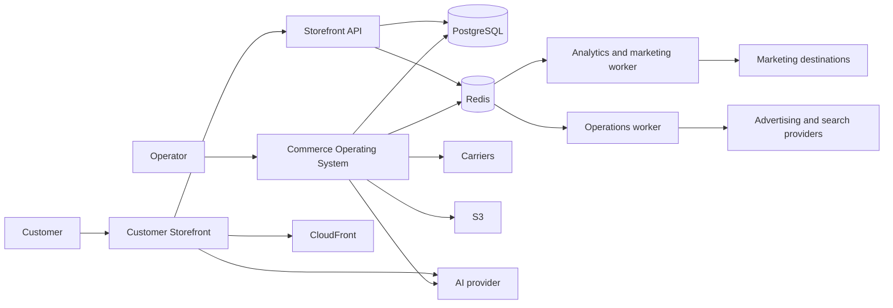

# Architecture

Bricomaitre is a `pnpm` workspace built around two product surfaces: the Customer Storefront and the Commerce Operating System.

## System shape

## Deployable applications

| Path                   | Package                | Responsibility                                                                                                            |
| ---------------------- | ---------------------- | ------------------------------------------------------------------------------------------------------------------------- |
| `apps/storefront/`     | `@bric/storefront`     | French and Arabic customer interface, SEO, localized commerce journeys, and the customer assistant                        |
| `apps/storefront-api/` | `@bric/storefront-api` | Canonical public catalog, order, analytics, merchandising, and signed order-access contracts                              |
| `apps/admin/`          | `@bric/admin`          | Authenticated operations interface, privileged APIs, migrations, reporting, carrier workflows, and the operator assistant |

The Storefront reaches public commerce behavior through the Storefront API and its established local BFF boundary. Admin may coordinate with that public boundary, but it does not become the hidden owner of storefront rules.

Each deployable application exposes `GET /api/health`. Releases preserve an immutable revision identity across web applications and workers.

## Shared packages

| Path                        | Package                 | Responsibility                                                                               |
| --------------------------- | ----------------------- | -------------------------------------------------------------------------------------------- |
| `packages/db/`              | `@bric/db`              | Drizzle client and canonical PostgreSQL schema exports                                       |
| `packages/storefront-core/` | `@bric/storefront-core` | Public DTOs, validation, order access, carrier client behavior, and shared commerce services |
| `packages/runtime/`         | `@bric/runtime`         | Redis, queues, rate limiting, idempotency, request trust, and internal signing               |
| `packages/ai-core/`         | `@bric/ai-core`         | Shared model configuration, AI contracts, usage, and pricing metadata                        |

## Runtime paths

**Catalog browsing**

The Customer’s browser reaches the Storefront. Server-side Storefront reads use the typed Storefront API client, and the API serves PostgreSQL-backed catalog and merchandising contracts with explicit cache tags.

**Order submission and access**

The Storefront API validates public input, applies rate limits and durable idempotency, commits the Order in PostgreSQL, and schedules non-blocking analytics delivery. Later public reads and updates require the Order’s access token.

**Authenticated operations**

Admin routes authenticate the Operator, enforce the resource-specific RBAC boundary, validate untrusted input, call the owning service, and record durable state or audit history. Background work passes through Redis and BullMQ when it needs retries, scheduling, isolation, or operator-visible progress.

**Analytics**

First-party events enter through the Storefront API and are processed asynchronously into session, event, and long-range aggregate facts. Admin reporting combines those facts with order outcomes, carrier data, advertising costs, and provider reporting without treating every submitted Order as paid commerce.

**Assistants**

Both assistants use model-led tool loops over bounded application capabilities. Code remains responsible for authorization, validation, invariants, effects, idempotency, and recovery. The assistants do not replace the storefront’s browsing and ordering paths or Admin’s direct operational interfaces.

## Fulfilment and carrier boundary

Confirmation Status and Shipment Status are separate state machines. The Commerce Operating System owns contact and confirmation work; carriers own transport events after Posting.

1. Carrier catalog synchronization validates wilayas, communes, service availability, and fees before replacing the persisted snapshot.
2. Admin previews classify Orders as eligible, skipped, or invalid before a Posting mutation.
3. Posting creates a Shipment and records its provider, tracking reference, initial state, history, and action evidence.
4. The Admin worker refreshes batch shipment state. Expensive per-Shipment detail remains on bounded scheduled or explicit paths.
5. Label, Dispatch, delivery, return, failure, and paid outcomes retain their distinct meanings.

The shared carrier client owns request validation, rate-limit interpretation, pacing, shipment operations, labels, and tracking. Admin owns provider selection and the operational workflow around it. Provider calls do not live directly in route handlers.

A failed catalog refresh preserves the last successful snapshot. Shipment creation is not retried blindly after an ambiguous network result because doing so can create duplicate Shipments. Current providers use separate configuration and credentials while sharing this boundary.

## External systems

External services are documented with the subsystem that owns their meaning:

| Capability                                                                          | Owning document or boundary                      |
| ----------------------------------------------------------------------------------- | ------------------------------------------------ |
| Carrier catalog, Posting, labels, and tracking                                      | Fulfilment boundary above                        |
| First-party analytics, advertising destinations, Meta reporting, and Search Console | [`analytics.md`](./analytics.md)                 |
| Model providers and assistant behavior                                              | [`ai.md`](./ai.md)                               |
| S3, CloudFront, Sentry, containers, releases, and backups                           | [`operations.md`](./operations.md)               |
| Admin identity and authorization                                                    | Admin application and route-level RBAC contracts |

## Failure boundaries

- Customer-facing reads may degrade to deliberate unavailable or empty states where doing so is truthful.
- Order mutations return structured, recoverable failures and never fabricate success.
- Analytics and telemetry do not block rendering, checkout, or order submission.
- Carrier outages do not enter the checkout request path.
- Cross-application contract changes update every affected consumer in the same change set.

## Repository map

- `apps/` contains deployable application source and app-owned tests.
- `packages/` contains shared code with explicit exports.
- `docs/adr/` records durable architectural decisions.
- `ops/` contains container, proxy, release, backup, restore, and host tooling.
- `.github/workflows/` contains CI and the serialized production release.
